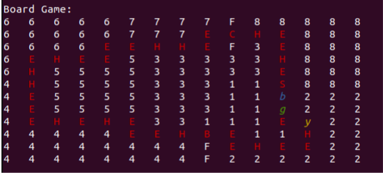
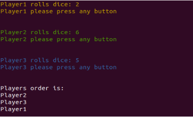

# Implementation of board game "Hotel" using Java
It's about the popular board game "Hotel", that every child used to love playing back in the 2000s.  
  

## How to run 
1. Copy the the required files to src dir.  
```
cp -R java-class-files/. src/
```
```
cp -R hotel-cards/. src/
```
```
cp -R board/. src/
```
```
cd hotel
```
5. Run hotel  
```
java hotel
```
6. Enjoy Hotel.    



